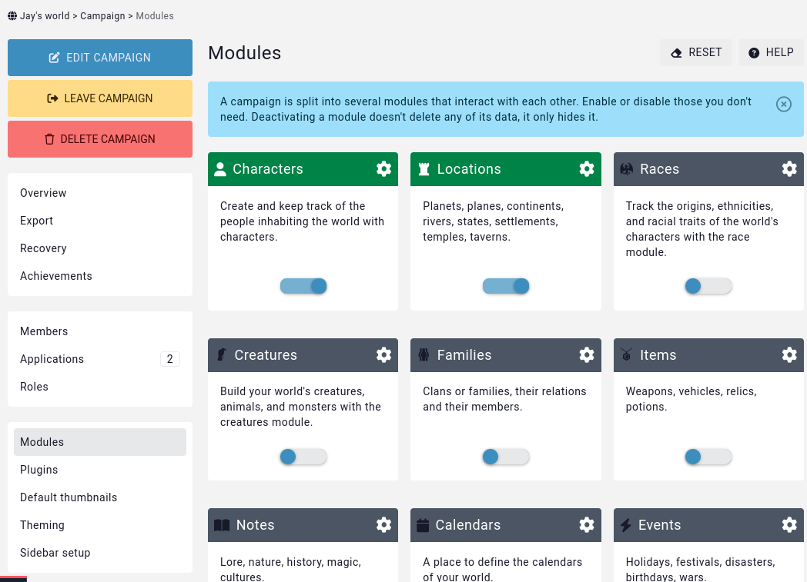
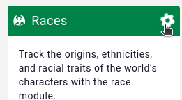

# Modules 

By default, a campaign has over fifteen types of entities enabled. If your world has no use of calendars or quests, these can be disabled.

From the campaign sidebar, click on **World**, and then go to the **Modules** subpage. This interface allows you to enable or disable types of entities that the campaign doesn't need.

```{admonition} Info
Disabling an entity type doesn't delete the related data from the campaign. Instead, it is simply **hidden**. Only members of the campaign's admin role can enable or disable modules.
```

## Modules enabled by default

Campaigns have automatically all modules enabled, except for the deprecated [conversations](/entities/conversations) and [dice rolls](/entities/dice-rolls) modules.

### Example

In the following example, all modules except for [characters](/entities/characters) and [locations](/entities/locations) have been disabled.

;

## Customising module names and icons

If you'd rather the [Race](/entities/races) module be named `Folk` throughout your Kanka campaign, you can do so. In the campaign's module interface, click on the cog wheel in the module's boy you want to change.



This brings up an interface to update the module's singular and plural name, as well as its icon. This works well for English and non-gendered languages, but will lead to weird sentences in every other one. 


### Module icon

The module icon field can be filled out with a [FontAwesome or RPGAwesome](/features/campaigns/sidebar#what-fonts-are-available) class.
